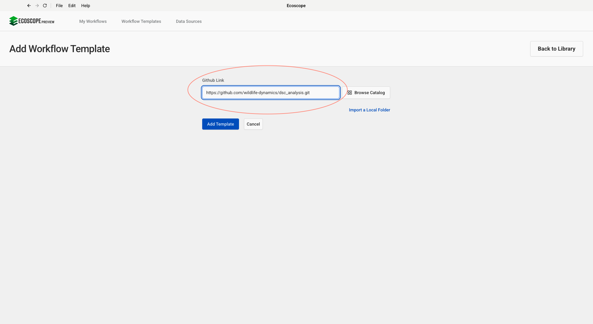
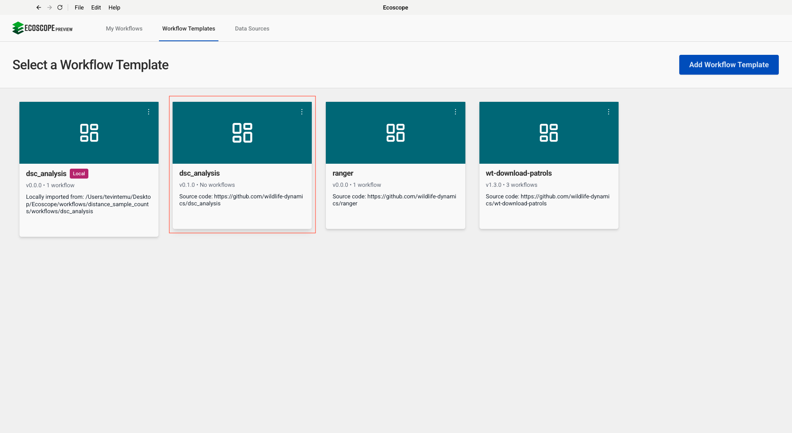
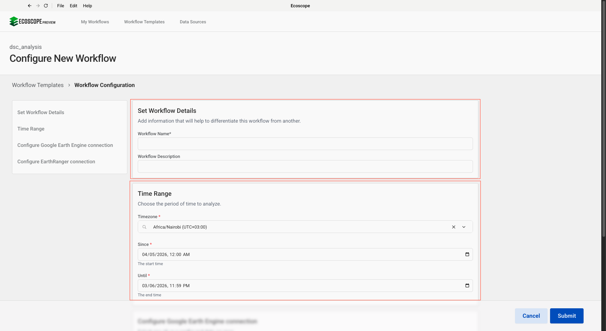
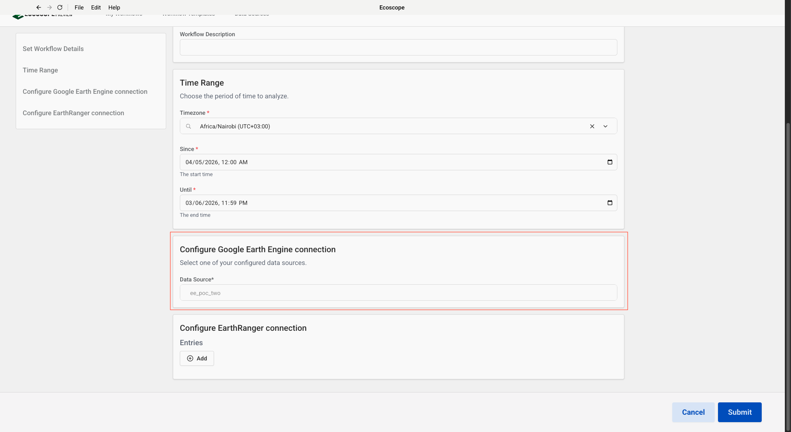
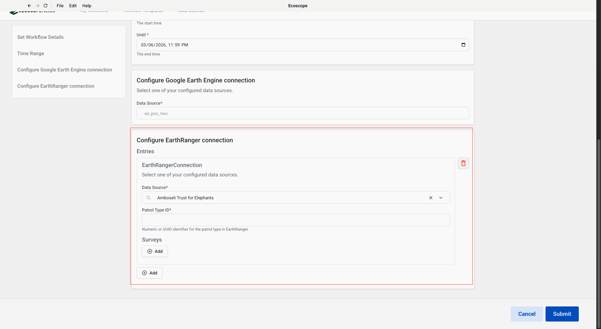
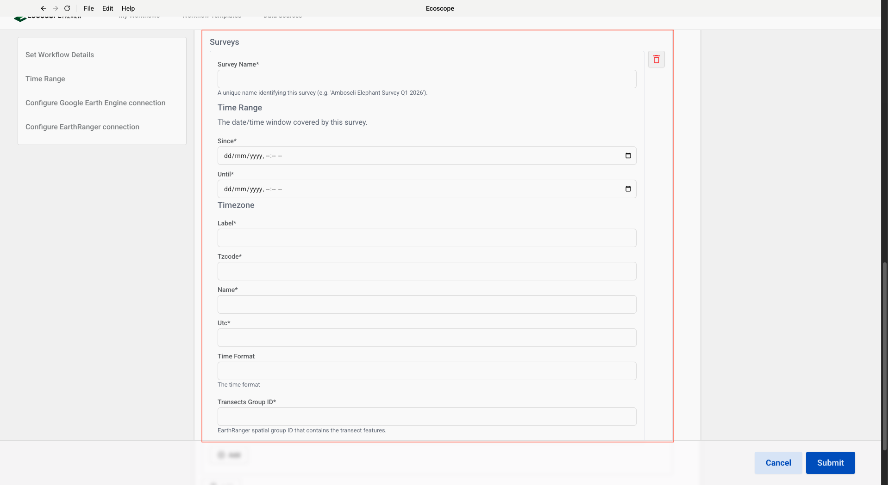

# DSC Analysis — User Guide

This guide walks you through configuring and running the Distance Sample Count (DSC) Analysis workflow, which ingests wildlife survey patrol data from EarthRanger, calculates distance sampling geometry, labels transects with satellite-derived environmental covariates, and exports analysis-ready datasets for population density modelling.

---

## Overview

The workflow supports **multiple surveys per run**. For each configured survey it produces:

- An **analysis metadata CSV** — survey event metadata including transect IDs, team members, observer counts, and event types
- An **analysis data CSV** — wildlife observations enriched with off-transect distances, orthogonal distances, estimated animal positions, HLS NDVI, and terrain slope
- An **events GeoPackage** — spatial point layer of wildlife observations with key distance sampling geometry columns
- A **transects GeoPackage** — visited transect lines labelled with mean NDVI and slope from Google Earth Engine
- An **original transects GeoPackage** — unprocessed transect lines as fetched from EarthRanger

---

## Prerequisites

Before running the workflow, ensure you have:

- Access to an **EarthRanger** instance with DSC patrol data logged using the event types:
  - `distancecountpatrol_rep` — survey metadata (transect ID, team, observer count)
  - `distancecountwildlife_rep` — wildlife observations (species, count, distance, radial angle)
- A **Google Earth Engine** service account configured in Ecoscope (used to retrieve NDVI and slope imagery)
- The **EarthRanger spatial group ID** for each survey's transect lines
- The **patrol type ID** (numeric or UUID) for the DSC patrol type in EarthRanger

---

## Step-by-Step Configuration

### Step 1 — Add the Workflow Template

In Ecoscope, go to **Workflow Templates** and click **Add Workflow Template**. Paste the GitHub repository URL into the **Github Link** field:

```
https://github.com/wildlife-dynamics/dsc_analysis.git
```

Then click **Add Template**.



---

### Step 2 — Select the Workflow

After the template is added it appears in the **Workflow Templates** list as **dsc_analysis**. Click the card to open the workflow configuration form.

> The card may show **Initializing…** briefly while the environment is set up.



---

### Step 3 — Set Workflow Details and Time Range

The configuration form opens with two sections at the top.

**Set Workflow Details**

| Field | Description |
|-------|-------------|
| Workflow Name | A short name to identify this run (required) |
| Workflow Description | Optional notes, e.g. survey season or region |

**Time Range**

This field is required on all Ecoscope workflows. It is used for timestamp display and UTC conversion only — it does **not** filter which patrol events are fetched from EarthRanger. Each survey's own time window (configured in Step 5) controls which data is pulled from EarthRanger.

Set this to a window that broadly covers all surveys in the run, or leave it wider than needed.

| Field | Description |
|-------|-------------|
| Timezone | Local timezone for display, e.g. `Africa/Nairobi (UTC+03:00)` |
| Since | Broad start boundary covering all surveys in this run |
| Until | Broad end boundary covering all surveys in this run |



---

### Step 4 — Configure Google Earth Engine Connection

Select your Google Earth Engine service account from the **Data Source** dropdown. This connection is used to build HLS NDVI composites and terrain slope images for transect labelling.

> Only one GEE connection is needed — it is shared across all surveys in the run.



---

### Step 5 — Configure EarthRanger Connection and Surveys

Scroll down to **Configure EarthRanger connection**. Click **+ Add** to add an EarthRanger site entry.

**EarthRanger Connection**

| Field | Description |
|-------|-------------|
| Data Source | Select the EarthRanger connection from the dropdown (e.g. `Amboseli Trust for Elephants`) |
| Patrol Type ID | The numeric or UUID identifier for the DSC patrol type in EarthRanger |

**Surveys**

Under the entry, click **+ Add** inside the **Surveys** section to define each survey. You can add multiple surveys under a single EarthRanger connection.

| Field | Description |
|-------|-------------|
| Survey Name | A unique name for this survey — used as the output filename prefix (e.g. `Amboseli_Elephant_Survey_Q1_2026`) |
| Since | Start of the data fetch window — patrol events on or after this time are retrieved from EarthRanger |
| Until | End of the data fetch window — patrol events up to this time are retrieved from EarthRanger |
| Timezone | The timezone for this survey's time window |
| Transects Group ID | The EarthRanger spatial group ID that contains the transect line features for this survey |





> To run multiple surveys from the **same EarthRanger site**, add additional entries in the **Surveys** list within one connection entry.  
> To run surveys from **different EarthRanger sites**, click the outer **+ Add** button to add a second connection entry.

---

## Running the Workflow

Once all parameters are configured, click **Submit**. For each survey the workflow will:

1. Fetch patrol events matching the configured patrol type ID and survey time window from EarthRanger.
2. Fetch transect lines from the configured EarthRanger spatial group.
3. Retrieve individual wildlife observation events from the patrol event IDs.
4. Process and normalise survey metadata events — extract transect ID, team members, and observer count.
5. Propagate metadata fields to wildlife observation rows using backward/forward fill within each patrol.
6. Reproject events and transects to a UTM coordinate system for metric distance calculations.
7. Calculate the perpendicular distance from each observer position to the transect centreline (`off_transect_dist`).
8. Estimate the true animal position from each observation's radial angle and distance to centre (`dist_to_centre`).
9. Calculate the orthogonal distance from the estimated animal position to the transect centreline (`ortho_dist`).
10. Filter events to those that intersect a 500 m transect buffer corridor; discard unvisited transects.
11. Label visited transects with mean HLS NDVI (max 30 % cloud cover) and terrain slope from Google Earth Engine (30 m resolution).
12. Merge transect covariates into the wildlife observation dataset.
13. Export all outputs per survey to `$ECOSCOPE_WORKFLOWS_RESULTS`.

---

## Output Files

All outputs are written to `$ECOSCOPE_WORKFLOWS_RESULTS/`. Five files are produced for **each survey** — `{survey}` is replaced by the Survey Name you entered in Step 5.

| File | Description |
|------|-------------|
| `{survey}_analysis_metadata.csv` | Survey metadata events: transect IDs, team members, observer counts, event types, lat/lon |
| `{survey}_analysis_data.csv` | Wildlife observations with all distance sampling fields: species, total count, juveniles, `dist_to_centre`, `radialangle`, `off_transect_dist`, `ortho_dist`, estimated geometry, `NDVI_HSL`, `slope`, `survey_id`, and more |
| `{survey}_events.gpkg` | Spatial point layer of wildlife observations (columns: `serial_number`, `transect_id`, `dist_to_centre`, `ortho_dist`, `intersects_transect`, `geometry`) |
| `{survey}_transects.gpkg` | Visited transect lines in EPSG:4326 with `NDVI_HSL`, `slope`, and `img_date_hsl_ndvi` columns |
| `{survey}_orig_transects.gpkg` | Original unprocessed transect lines as fetched from EarthRanger (EPSG:4326) |
